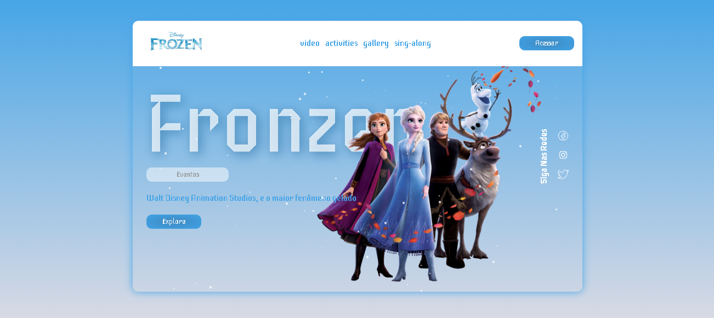

<h1 align="center">Animação Frozen</h1>

Esse projeto tem como objetivo trabalhar com animação. 
onde pude apreender muitos  conceitos de manipulação do css utilizando o JavaScript.

Nesso projeto pude manipular pequenas particulas cujo o objetivo fosse representar a neve caindo de forma constante.

Nesse projeto pude deixar em foco os personagens.
enfoco maior é trabalhar com telas grandes e não com versões mobile.

<h3>Tecnologias utilizadas</h3>

<ul>
<li>HTML</li>
<li>CSS</li>
<li>GITHUB</li>
<li>JAVASCRIPT</li>

</ul>

## Animation
para animação foi utilizado apenas Css e JavaScript

<footer>

<a href="https://dribbble.com/shots/11434849-Frozen-UI-design-concept">Image Referencia</a>

</footer>